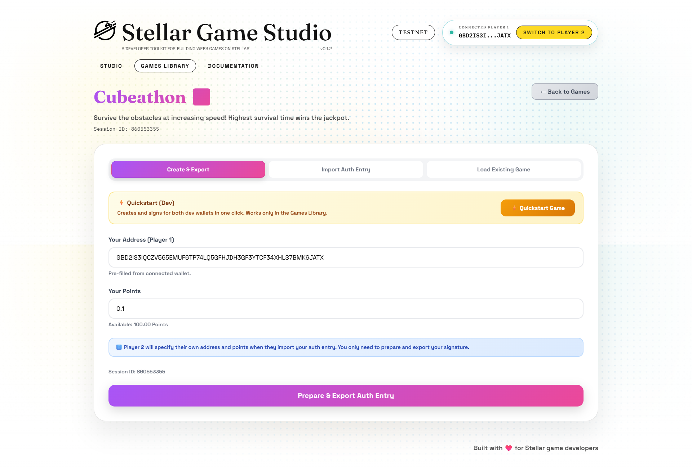
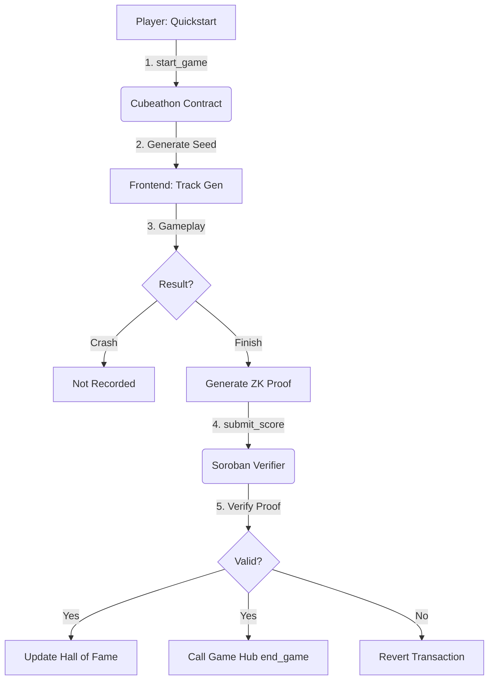
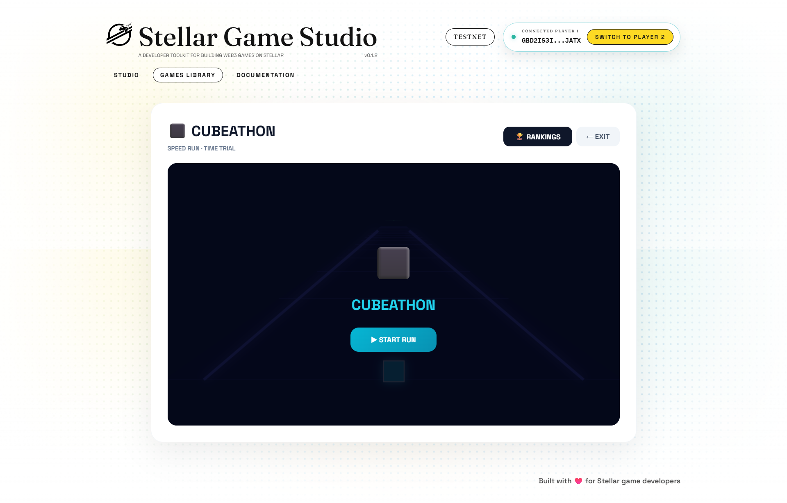
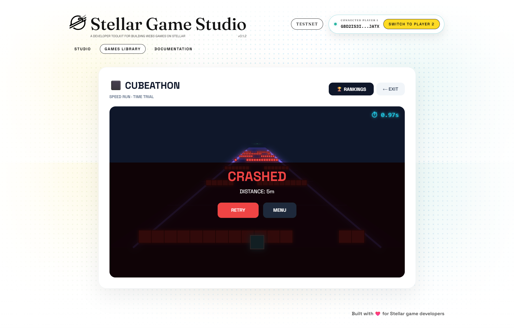
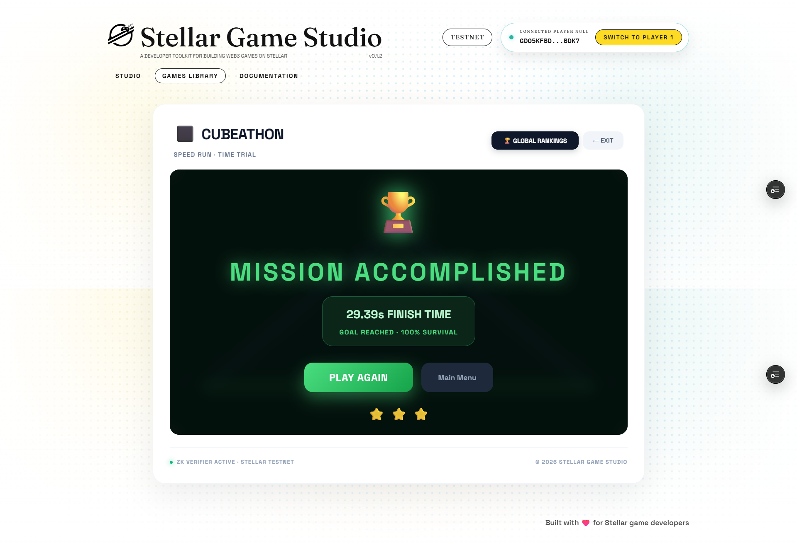

# ⬛ Cubeathon — ZK-Powered Speed Run on Stellar

**Cubeathon** is a high-intensity, cyber-neon racing prototype built for the **Stellar ZK Gaming Hackathon 2026**. It leverages Zero-Knowledge Proofs (ZKP) and Soroban smart contracts to create a "Fair by Design" competitive environment where speed is verified and cheating is mathematically impossible.



[](#) [](#) [](#) [](#)

---

## 📽️ Video Demonstration
> **[Watch the Cubeathon Demo on YouTube](https://youtube.com/link-to-your-video)**  
> *This video covers gameplay, the ZK generation process, and the on-chain finalization flow.*

---

## 💎 The ZK Core: "Provable Maneuverability"

In most web games, leaderboard data is easily manipulated by intercepting API calls or modifying client-side memory. In **Cubeathon**, your score doesn't exist until you prove it.

### How it works:
1.  **Unique Session Seed**: Every match starts with an on-chain seed that procedurally generates a unique 1.5km obstacle course.
2.  **Verifiable Execution**: As you race, your movement journal is tracked. Upon crossing the finish line, the game generates a **ZK Proof (via Noir)**.
3.  **On-Chain Verification**: The Soroban smart contract acts as the ultimate referee. It takes the proof, your time, and the session ID. It re-verifies that your path safely navigated the obstacles derived from that session's seed.
4.  **No ZK, No Entry**: If you collided with a block (even if you "hacked" the client to ignore it), the ZK proof will fail, and the contract will reject your leaderboard entry.

## 🏗️ System Architecture



## 📸 Visual Walkthrough

| 🏎️ Ready to Race | 💥 Crash (Not Recorded) | 🏆 ZK-Verified Win |
| :---: | :---: | :---: |
|  |  |  |

---

## 🔗 On-Chain Architecture (Stellar Testnet)

Our deployment follows the strict hackathon requirements for Game Hub integration:

-   **Cubeathon Game Contract**: [`CDWMVCILTY3O3VMT4NWYJ266GJNH6FAXWGLNIZM2SJSIHQIBTSJXYDPJ`](https://lab.stellar.org/r/testnet/contract/CDWMVCILTY3O3VMT4NWYJ266GJNH6FAXWGLNIZM2SJSIHQIBTSJXYDPJ)
-   **Mandatory Game Hub**: [`CB4VZAT2U3UC6XFK3N23SKRF2NDCMP3QHJYMCHHFMZO7MRQO6DQ2EMYG`](https://lab.stellar.org/r/testnet/contract/CB4VZAT2U3UC6XFK3N23SKRF2NDCMP3QHJYMCHHFMZO7MRQO6DQ2EMYG)
-   **ZK Verifier Contract**: [`CDO6JBSEUUOO5QQENIZCH3AT2K3T4ZEU724K2GJGOP77TZ3PZCCUXGNW`](https://lab.stellar.org/r/testnet/contract/CDO6JBSEUUOO5QQENIZCH3AT2K3T4ZEU724K2GJGOP77TZ3PZCCUXGNW)

### Lifecycle Integration:
-   **`start_game()`**: Called when a new race session is initiated.
-   **`end_game()`**: Triggered during the "Finalize Match" step after a successful ZK-verified finish. This ensures the Game Hub is aware of every match outcome.

---

## 🛠️ The Tech Stack

| Layer | Technology |
| :--- | :--- |
| **Logic** | Soroban Smart Contracts (Rust) |
| **ZK Circuit** | Noir Lang (Verifiable Computation) |
| **Frontend** | React 18 + Vite |
| **Styling** | Cyber-Neon Vanilla CSS |
| **Network** | Stellar Testnet (Protocol 25) |
| **Toolchain** | Stellar Game Studio (SGS) |

---

## 🚀 Installation & Local Development

To run the frontend locally and connect your wallet:

```bash
# Clone the repository
git clone https://github.com/NikhilRaikwar/Cubeathon.git
cd Cubeathon/frontend

# Install dependencies
bun install

# Start development server
bun run dev
```

### Environment Setup
Create a `.env` file in the `frontend` directory:
```text
VITE_SOROBAN_RPC_URL=https://soroban-testnet.stellar.org
VITE_NETWORK_PASSPHRASE=Test SDF Network ; September 2015
VITE_CUBEATHON_CONTRACT_ID=CDWMVCILTY3O3VMT4NWYJ266GJNH6FAXWGLNIZM2SJSIHQIBTSJXYDPJ
```

---

## ⚖️ License
Distributed under the MIT License. See `LICENSE` for more information.

---

Built with ❤️ by **Nikhil Raikwar** for the Stellar ZK Gaming Hackathon 2026.
